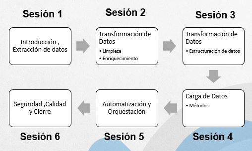
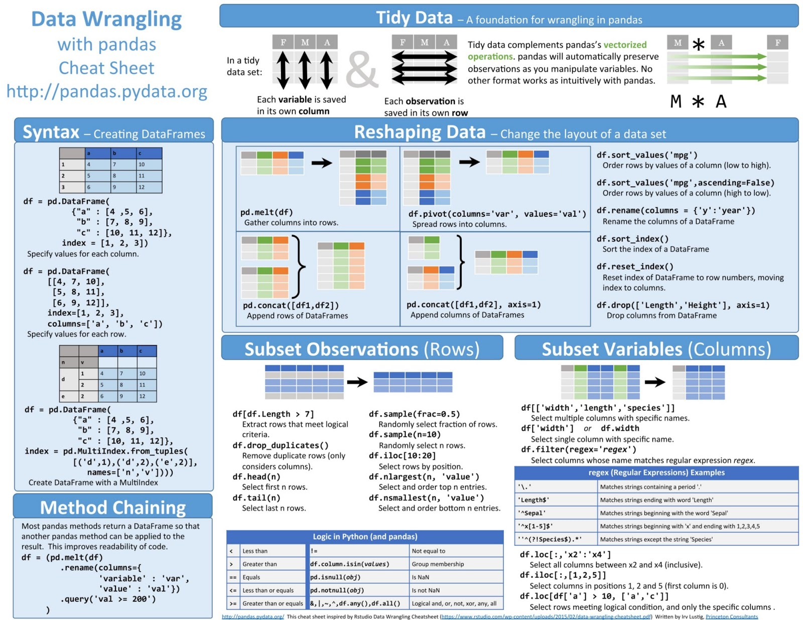
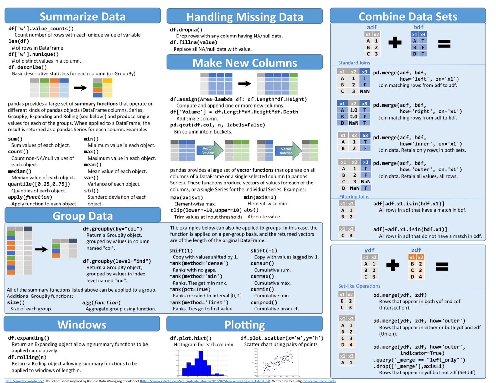

# 2024_04

## Procesamiento ETL

## Objetivo

## Descripción

## Herramientas

- [ ] [Python 3.7.9](https://www.python.org/ftp/python/3.7.9/python-3.7.9-amd64.exe)
- [ ] [Visual Studio Code](https://code.visualstudio.com/)
- [ ] [Opcional Colab](https://colab.research.google.com/)

## Sesion 1 (Martes 2 de abril 2024)

### titulo: introducción y Extración de Datos

Creación de clase estandar para obtener información.

## Sesion 2 (Viernes 5 de abril 2024)

### titulo: Transformación de Datos

#### Limpieza

#### Enriquecimiento

## Sesion 2 (Sabado 6 de abril 2024)

### titulo: Transformación de Datos

#### Estructuración de datos

## Creación Ambiente

- [ ] [Set up project integrations](https://gitlab.com/procesamiento_etl_itm_2024_1/2024_04/-/settings/integrations)

## Documentación

### Pandas

[Pandas](https://pandas.pydata.org/) es una herramienta de análisis y manipulación de datos de código abierto rápida, potente, flexible y fácil de usar, construida sobre Python.

Pandas significa **Pan**el **Da**ta. Los paneles de datos son estructuras simples donde se puede organizar por categorias los datos en donde podemos tener variables tipo texto, numericos o booleanos. Cuenta con un eje de filas donde los datos pueden estar organizados temporalmente.

#### Dataset

- [ ] Sesion 2 y 3:

- [population world since 1960 to 2021](https://www.kaggle.com/datasets/fredericksalazar/population-world-since-1960-to-2021?select=data_population_world.csv)
- [Synthetic MP Data in Lisbon](https://www.kaggle.com/datasets/miguelgarcaosilva/synthetic-mp-data-in-lisbon)
- [years of world education by country](https://www.kaggle.com/datasets/fredericksalazar/average-years-of-schooling-since-1870-2017?select=mean-years-of-schooling-long-run.csv)
- [PIB-GDP Global by countries since 1960 to 2021](https://www.kaggle.com/datasets/fredericksalazar/pib-gdp-global-by-countries-since-1960-to-2021)

#### Ventajas

- Reduce lineas de código
- Diseñada especialmente para análisis
- API fácil y concisa
- Multiples funciones

#### Desventajas

- Compatibilidad con matrices 3 (numpy)
- Curva de aprendizaje lenta

#### Cheat sheet

## Visuals

Depending on what you are making, it can be a good idea to include screenshots or even a video (you'll frequently see GIFs rather than actual videos). Tools like ttygif can help, but check out Asciinema for a more sophisticated method.

## Installation

Within a particular ecosystem, there may be a common way of installing things, such as using Yarn, NuGet, or Homebrew. However, consider the possibility that whoever is reading your README is a novice and would like more guidance. Listing specific steps helps remove ambiguity and gets people to using your project as quickly as possible. If it only runs in a specific context like a particular programming language version or operating system or has dependencies that have to be installed manually, also add a Requirements subsection.

## Usage

Use examples liberally, and show the expected output if you can. It's helpful to have inline the smallest example of usage that you can demonstrate, while providing links to more sophisticated examples if they are too long to reasonably include in the README.

## Support

Tell people where they can go to for help. It can be any combination of an issue tracker, a chat room, an email address, etc.

## Roadmap

If you have ideas for releases in the future, it is a good idea to list them in the README.

## Contributing

State if you are open to contributions and what your requirements are for accepting them.

For people who want to make changes to your project, it's helpful to have some documentation on how to get started. Perhaps there is a script that they should run or some environment variables that they need to set. Make these steps explicit. These instructions could also be useful to your future self.

You can also document commands to lint the code or run tests. These steps help to ensure high code quality and reduce the likelihood that the changes inadvertently break something. Having instructions for running tests is especially helpful if it requires external setup, such as starting a Selenium server for testing in a browser.

## Authors and acknowledgment

Show your appreciation to those who have contributed to the project.

## License

For open source projects, say how it is licensed.

## Project status

If you have run out of energy or time for your project, put a note at the top of the README saying that development has slowed down or stopped completely. Someone may choose to fork your project or volunteer to step in as a maintainer or owner, allowing your project to keep going. You can also make an explicit request for maintainers.
